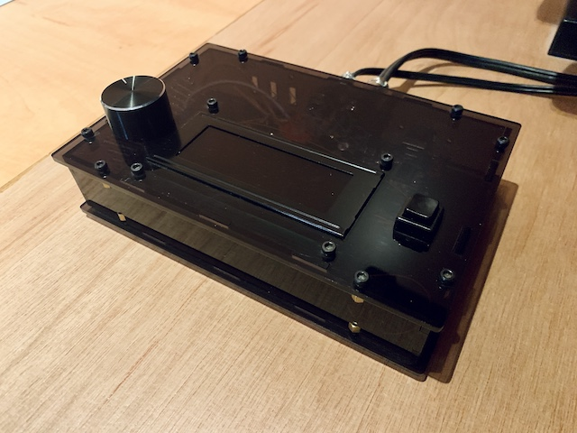
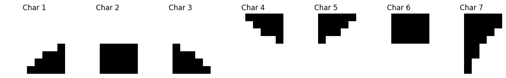

# Darkroom Timer for Photographic Development



This Arduino-based project serves as a reliable timer for the photographic darkroom process. It uses a custom LCD character display for clear and precise visual feedback, making it an essential tool for photographers during the development of their work.

## Features

- Customizable timer settings with EEPROM for persistent storage.
- Intuitive interface with a rotary encoder for adjusting the timer delay.
- Start/stop button for exposure control with a long-press feature to manually control the enlarger lamp.
- Automatic reset to zero with the rotary encoder's push button.
- Relay output to control the enlarger lamp.

## Long-Press Functionality

The exposure button has an additional long-press feature:

- A long press (at least 2 seconds) on the exposure button will turn the enlarger lamp ON, bypassing the timer.
- Pressing the button again will turn the lamp OFF.
- The long-press delay is defined by `turnEnlargerLampOnDelay = 2000;` which corresponds to 2000 milliseconds (2 seconds).

## Maximum Timer Delay

The maximum timer delay that can be set is 99 seconds (99000 milliseconds). This limit ensures that the exposure times are kept within a practical range for darkroom processes.

## Requirements

### Software Libraries
- **MD_REncoder**: Rotary Encoder Library. Installable from [MD_REncoder GitHub Repository](https://github.com/MajicDesigns/MD_REncoder).
- **New-LiquidCrystal**: LCD Library for Arduino and Chipkit. Installation details can be found at [New-LiquidCrystal GitHub Repository](https://github.com/fmalpartida/New-LiquidCrystal).

### Hardware Components
- A rotary encoder with a built-in push button to adjust the timer delay and reset the timer.
- A push button to start the exposure, with a long-press feature to manually control the enlarger lamp.
- A relay module to switch the enlarger lamp on and off.
- LCM1602 interface module with a 4x20 character LCD display.

### Wiring
- **Rotary Encoder**: Middle pin to ground, A and B pins to digital inputs. Push button to reset the timer.
- **Push Button**: Digital input to start the exposure, with a long-press functionality.
- **Relay**: Digital output to control the enlarger lamp.
- **Manual Light Indicator**: Digital output to indicate manual light mode.

## LCD I2C connection
Use the I2C interface module (for example LCM1602) to connect the LCD to the Arduino. The I2C module simplifies the wiring and reduces the number of pins required to connect the LCD to the Arduino. Use an I2C scanner of your choice to find the I2C address of the LCD module. I've include a simle arduino sketch by Arbi Abdul Jabbaar in the project as well. The default address is 0x27.

## LCD Character Display

The project utilizes a custom-defined character set to display information on a standard 4x20 character LCD. The custom character set, referred to as "bigNumbers," is designed to render large, clear, and easy-to-read characters on the LCD. It's based on the work by Adrian Jones, as described in the article: http://woodsgood.ca/projects/2015/02/27/4-line-lcd-big-numbers/

Characters are defined using an 8x5 dot matrix pattern for each segment, allowing for versatile and clear character representations. The character set is defined as follows:



```c
// Definitions of custom LCD character segments
const byte segmentPatterns[][8] PROGMEM = {
    {0x00, 0x00, 0x00, 0x00, 0x01, 0x07, 0x0F, 0x1F}, // char 1: top left triangle
    // ... (additional characters)
    {0x1F, 0x1F, 0x1E, 0x1C, 0x18, 0x18, 0x10, 0x10}  // char 7: middle right triangle
};

```
- 0xFE is used to denote a segment that is off.
- 0xFF represents a segment that is fully lit.

### Example - Rendering the Digit "0":
The digit "0" is constructed using twelve segments arranged in a 3x4 grid. Here's how the segments from segmentPatterns are utilized to form the digit "0" on the LCD:

|  LCD Line  |   segmentPatterns   |    bigNumbers     |
| ------ | ---------------------- | ---------------- |
| Line 1 | char 1, char 2, char 3 | 0x01, 0x02, 0x03 |
| Line 2 | ON, OFF, ON            | 0xFF, 0xFE, 0xFF |
| Line 3 | ON, OFF, ON            | 0xFF, 0xFE, 0xFF |
| Line 4 | char 4, char 6, char 5 | 0x04, 0x06, 0x05 |

LCD output for the digit "0":

```
..... ..... .....
..... ..... .....
..... ..... .....
..... ..... .....
....# ##### #....
..### ##### ###..
.#### ##### ####.
##### ##### #####

##### ..... #####
##### ..... #####
##### ..... #####
##### ..... #####
##### ..... #####
##### ..... #####
##### ..... #####
##### ..... #####

##### ..... #####
##### ..... #####
##### ..... #####
##### ..... #####
##### ..... #####
##### ..... #####
##### ..... #####
##### ..... #####

##### ##### #####
.#### ##### ####.
..### ##### ###..
....# ##### #....
..... ..... .....
..... ..... .....
..... ..... .....
..... ..... .....
```

## Getting Started

To get started with the Darkroom Timer:

1. Install the Arduino IDE from the [official website](https://www.arduino.cc/en/software).
2. Clone this repository to your local machine.
3. Open `darkroom_timer.ino` with the Arduino IDE.
4. Connect your Arduino to your computer via USB.
5. Select the correct board and port in the Arduino IDE.
6. Upload the sketch to your Arduino board.

## Usage

- Use the buttons on the timer to set the desired time for development.
- Start the timer by pressing the exposure button. LCD will turn off during the exposure to prevent light leaks.
- The LCD will turn on when the development time is completed.
- If you need to manually control the enlarger lamp, press and hold the exposure button for at least 2 seconds to turn the lamp on. Press the button again to turn it off.

## Contributing

Contributions to the Darkroom Timer project are welcome. To contribute:

1. Fork the repository.
2. Create a feature branch: `git checkout -b new-feature`
3. Commit your changes: `git commit -am 'Add some feature'`
4. Push to the branch: `git push origin new-feature`
5. Submit a pull request.

## License

This project is open-source and available under the [MIT License](LICENSE.md).
